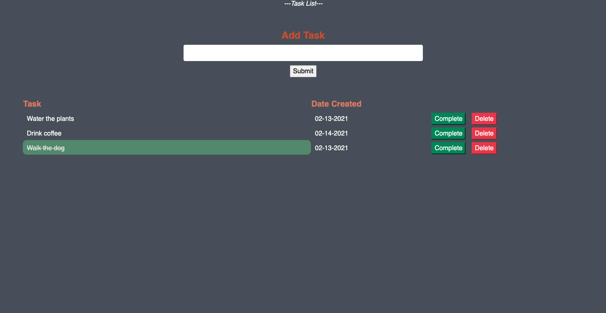

# Project Name

Server Side Calculator

## Description

_Duration: Weekend Challenge_

The third weekend challenge of Prime Digital Academy. The challenge was to create a client-side ToDo list application that sends and stores information in a database, and sends the information back to the client, displays the tasks for the user, and allows the option for a user to complete and delete tasks.

## Screenshot

### Prerequisites

- [Node.js](https://nodejs.org/en/)
- [postgresql](https://www.postgresql.org/)

## Installation

1. Download code from Github
2. Open the folder in an editor of your choice
3. Run an 'npm install' in your terminal
4. Run 'npm install pg' to install postgres
5. Create a Database called "weekend-to-do-app"
6. Using the database.sql code, create a table in the database
7. Run 'npm start' in your terminal to start the server
8. Open 'localhost:5000' in your browser!

## Usage

1. Type a task into the input
2. Click Submit to see the task on the page
3. The "Date Created" column will auto-fill with the date that the task was created.
4. Click the green "Complete" button to mark a task as complete
5. You can click the "complete" button a second time to "un-complete" a task
6. Click the red "Delete" button to delete a task.

## Built With

HTML // CSS // Bootstrap // Javascript // jQuery // node.js // SQL

## License

[MIT](https://choosealicense.com/licenses/mit/)

## Acknowledgements

Thanks to [Prime Digital Academy](www.primeacademy.io), and specifically Myron Schippers, Edan Schwartz, and Chad Smith who equipped me with the knowledge that helped me to make this application a reality.
